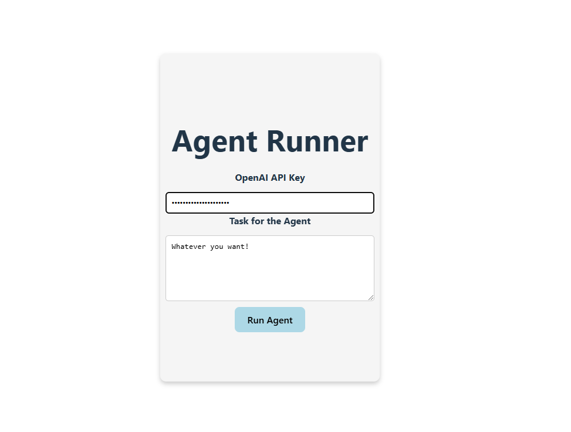

# Agent Runner

A web application that allows you to run automated browser tasks using AI. The application consists of a Flask backend and a React frontend.


## Features

- Execute automated browser tasks using OpenAI's GPT models
- Simple and intuitive user interface
- Configurable OpenAI API key
- Real-time task execution feedback

## Prerequisites

- Python 3.12 or higher
- Node.js and npm
- OpenAI API key

## Setup and Running

### Backend Setup

1. Navigate to the backend directory:
```bash
cd agente-back
```

2. Install dependencies using uv:
```bash
uv pip install -r pyproject.toml
```

3. Run the Flask server:
```bash
uv run agente.py
```

The backend will start on `http://localhost:5000`

### Frontend Setup

1. Navigate to the frontend directory:
```bash
cd agente-front
```

2. Install dependencies:
```bash
pnpm install
```

3. Start the development server:
```bash
npm run dev
```

The frontend will be available at `http://localhost:5173`

## Usage

1. Open your browser and go to `http://localhost:5173`
2. Enter your OpenAI API key
3. Write your task description
4. Click "Run Agent" to execute the task

## Project Structure

```
agente/
├── agente-back/         # Flask backend
│   ├── agent.py        # Main backend application
│   └── system_prompt.py # System prompt configuration
└── agente-front/        # React frontend
    └── src/
        ├── App.jsx     # Main React component
        └── App.css     # Styles
```

## Citations

This project uses the Browser Use library:

```bibtex
@software{browser_use2024,
  author = {Müller, Magnus and Žunič, Gregor},
  title = {Browser Use: Enable AI to control your browser},
  year = {2024},
  publisher = {GitHub},
  url = {https://github.com/browser-use/browser-use}
}
```
